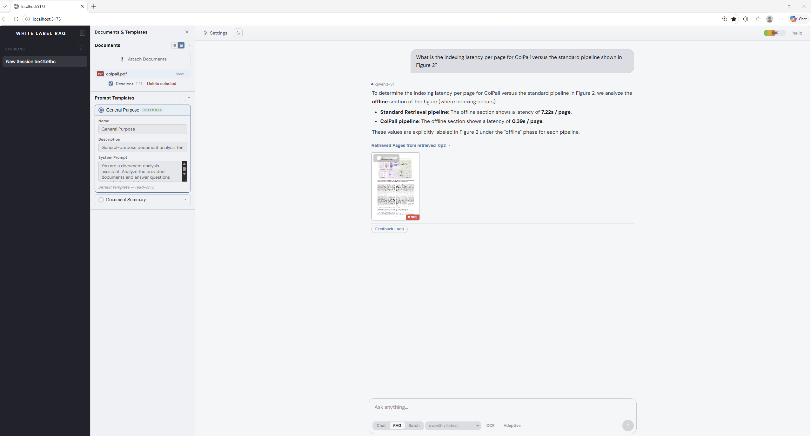
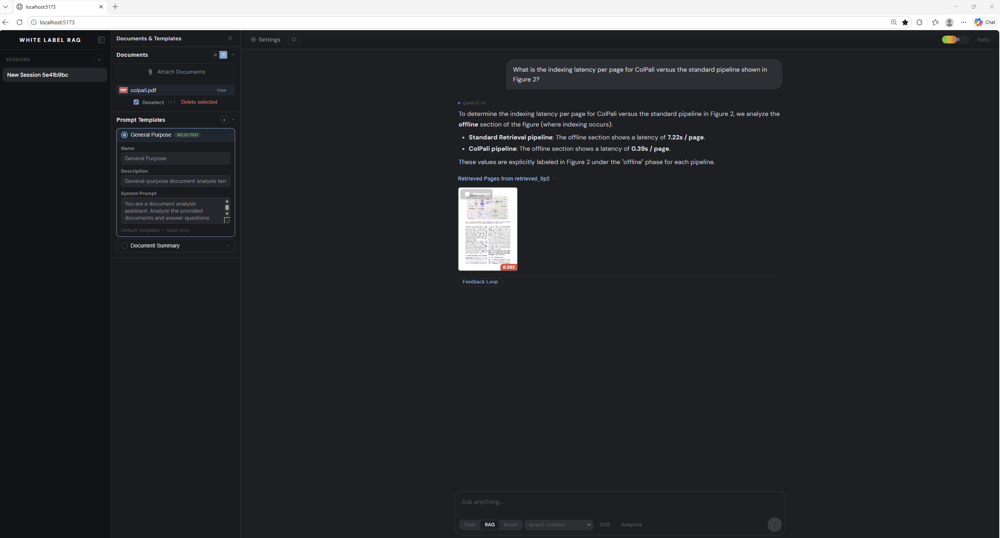

# RAG Lab

[](LICENSE)
[](https://python.org)
[](https://fastapi.tiangolo.com)
[](https://svelte.dev)

A local-first visual document analysis workbench. Upload PDFs and images, ask questions, and get answers grounded in your documents — all running on your own hardware.

RAG Lab uses **ColPali visual embeddings** to understand document layout and content visually, paired with any **Ollama-compatible LLM** for inference. Run models locally or connect to [Ollama Cloud](https://docs.ollama.com/cloud) for larger models.

<p align="center">
  
  
</p>

## Features

- **Visual RAG** — ColPali embeddings capture page layout, tables, and figures natively without text extraction. Optional OCR mode extracts text from retrieved pages for LLMs that work better with text input.
- **Any Ollama model** — Works with any local model, plus [Ollama Cloud](https://docs.ollama.com/cloud) models via API key (Settings > Advanced). Vision, text, and reasoning models supported.
- **Batch processing** — Process multiple documents with per-document streaming responses.
- **Full-document summarization** — Generic queries ("summarize") automatically process all pages in sequential chunks.
- **Prompt templates** — Create custom extraction templates (e.g., K-1 line item extractor) for structured data output.
- **Conversation memory** — Mem0 automatically extracts and recalls context across sessions.
- **Multi-session** — Create, switch, and manage independent analysis sessions.
- **Adaptive retrieval** — Score-slope analysis dynamically adjusts how many pages are retrieved per query.

## Quick Start

### Prerequisites

- **Python 3.10+** with CUDA-capable GPU
- **[Ollama](https://ollama.com)** installed and running
- **Node.js 18+** for the frontend

### 1. Clone and install

```bash
git clone https://github.com/inkind79/rag-lab.git
cd rag-lab

# Python environment
python -m venv venv
source venv/bin/activate
pip install -r requirements.txt

# Frontend
cd frontend
npm install
cd ..
```

### 2. Pull models

```bash
# Any Ollama model for chat — vision models recommended for document analysis
ollama pull <your-preferred-model>   # e.g., gemma4, qwen3-vl, llama3.2-vision, phi4

# Required by Mem0 for conversation memory
ollama pull nomic-embed-text         # embeddings
ollama pull gemma3:4b                # memory extraction (small text model)
```

RAG Lab auto-detects your installed Ollama models on startup — no configuration needed.

### 3. Configure

```bash
cp .env.example .env
# Optionally edit .env to set a persistent JWT_SECRET (a random one is generated if not set)
```

### 4. Run

```bash
# Terminal 1: Backend
uvicorn fastapi_app:app --host 127.0.0.1 --port 8000

# Terminal 2: Frontend
cd frontend && npm run dev
```

Open **http://localhost:5173** — create an account at `/register`, then sign in.

## Architecture

```
rag-lab/
├── fastapi_app.py              # Application entry point
├── src/
│   ├── api/                    # FastAPI routes (auth, chat, sessions, documents)
│   ├── models/                 # ColPali adapter, Ollama/HF handlers, LanceDB, RAG retriever
│   ├── services/               # Document processor, response generator, batch processor
│   └── utils/                  # Memory management, model configs, logging
├── frontend/
│   └── src/
│       ├── routes/             # SvelteKit pages (+page.svelte, +layout.svelte)
│       └── lib/
│           ├── components/     # Markdown, DocumentPanel, TemplatePanel, Settings
│           ├── stores/         # Svelte stores (chat, session, toast)
│           └── api/            # API client (streamChat, sessions, documents)
└── config/                     # Model configs, global settings
```

## Stack

| Layer | Technology |
|-------|-----------|
| Frontend | SvelteKit 2, Svelte 5, TypeScript |
| Backend | FastAPI, Python 3.10+ |
| Embeddings | ColQwen3.5 (ColPali visual embeddings) |
| Vector store | LanceDB (multi-vector, local) |
| LLM inference | Ollama (any local model — vision, text, or reasoning) |
| Memory | Mem0 (automatic, local Ollama + ChromaDB) |
| Auth | FastAPI-Users (SQLite, registration, argon2 hashing, JWT cookies) |

## System Requirements

- **GPU**: NVIDIA with 8GB+ VRAM (16GB+ recommended for larger models)
- **RAM**: 16GB+
- **Storage**: 20GB+ (models + dependencies)
- **OS**: Linux / WSL2 (requires NVIDIA CUDA support)

## Contributing

Contributions are welcome. Please open an issue first to discuss what you'd like to change.

1. Fork the repo
2. Create a feature branch (`git checkout -b feature/my-feature`)
3. Commit your changes
4. Push to the branch and open a Pull Request

## License

MIT — see [LICENSE](LICENSE) for details.
